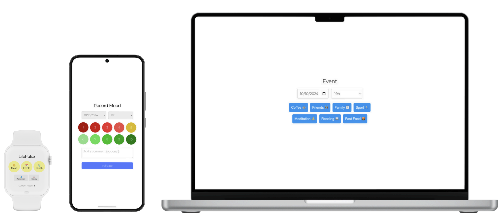

# LifePulse

```
 _      _  __     _____       _          
| |    (_)/ _|   |  __ \     | |         
| |     _| |_ ___| |__) |   _| |___  ___ 
| |    | |  _/ _ \  ___/ | | | / __|/ _ \
| |____| | ||  __/ |   | |_| | \__ \  __/
|______|_|_| \___|_|    \__,_|_|___/\___|
```

## 🌱 About LifePulse

LifePulse is a simple life habit and health tracker application designed to help you monitor and understand the interplay between your daily habits and health metrics. I've created LifePulse with the following goals in mind:
- Making it **easy-to-use** and as simple as possible
- Provide a smooth user experience across all kind of devices and screen sizes, especially **smartwatches**
- Integrate with **Fitbit** to easily track health metrics such as sleep or activity
- Integrate with **Google Calendar** to track the hours spend on your projects

<p align="center">
  
</p>

## 🚀 Getting Started

The simplest way to get started is to run it directly with Python.

### Option 1: Run with Python

1. **Clone the Repository:**
   ```bash
   git clone https://github.com/louisguichard/lifepulse.git
   cd lifepulse
   ```

2. **Install dependencies:**
   ```bash
   pip install -r requirements.txt
   ```

3. **Run the application:**
   ```bash
   python app.py
   ```

4. **Access the Application:**
   Open your browser and navigate to `http://localhost:8080`. You should be able to use LifePulse locally!

### Option 2: Run with Docker

Docker simplifies the process of running applications in isolated containers. This is especially useful for deploying LifePulse, for example on cloud platforms.

1. **Clone the Repository:**
   ```bash
   git clone https://github.com/louisguichard/lifepulse.git
   cd lifepulse
   ```

2. **Build and run with Docker:**
   ```bash
   docker build -t lifepulse .
   docker run -d -p 8080:8080 lifepulse
   ```

3. **Access the Application:**
   Open your browser and navigate to `http://localhost:8080`. You should be able to use LifePulse locally!

💡 Optionally, you can update the `config.json` file to use your own events!

Additionally, if you want to use Cloud Storage to save your data or integrate with Fitbit or Google Calendar, create a `.env` file based on the `.env.example` one. Note that Fitbit and Google Calendar integration will require you to [create your own Fitbit application](https://dev.fitbit.com/apps/new) and [Google Calendar application](https://console.cloud.google.com/apis/credentials) to obtain the client ID and secret.


## ☁️ How I Use LifePulse

I've deployed **LifePulse** on **Google Cloud Run**, making it easy to access from all my devices. Since LifePulse handles sensitive health data, I chose to keep it for my **personal use only**. Although I've tried to make access to my own data secure, my current knowledge doesn't allow me to guarantee this, and therefore to handle other people's sensitive data.
